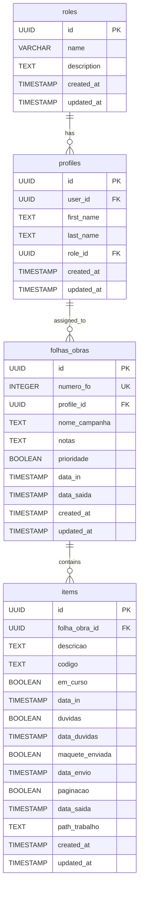

# Designer Flow App - Database Documentation

## Database Overview

This document provides a comprehensive description of the database structure for the Designer Flow application, which manages the workflow of design jobs from creation to completion.

## Tables

### 1. folhas_obras

**Purpose:** Stores the main work order information for design jobs.

| Column | Type | Constraints | Description |
|--------|------|-------------|-------------|
| id | UUID | PRIMARY KEY, DEFAULT uuid_generate_v4() | Unique identifier for the work order |
| numero_fo | INTEGER | NOT NULL, CHECK (0-9999), UNIQUE | Work order number (max 4 digits) |
| profile_id | UUID | REFERENCES profiles(id) | ID of the designer assigned to the work |
| nome_campanha | TEXT | NOT NULL | Name of the campaign |
| notas | TEXT | | Optional notes about the work order |
| prioridade | BOOLEAN | DEFAULT false | Priority flag for the work order |
| data_in | TIMESTAMP WITH TIME ZONE | DEFAULT NOW() | Date when the work order was created |
| data_saida | TIMESTAMP WITH TIME ZONE | NULL until completion | Date when all items in the work order are completed |
| created_at | TIMESTAMP WITH TIME ZONE | DEFAULT NOW() | Record creation timestamp |
| updated_at | TIMESTAMP WITH TIME ZONE | DEFAULT NOW(), auto-updated | Last update timestamp |

**Indexes:**
- Primary key on `id`
- Unique constraint on `numero_fo`
- Index on `profile_id` for faster lookups
- Index on `prioridade DESC, data_in DESC` for optimized sorting

**Comments:** "Work orders for design jobs"

### 2. items

**Purpose:** Stores individual design items within work orders, tracking their status through the workflow.

| Column | Type | Constraints | Description |
|--------|------|-------------|-------------|
| id | UUID | PRIMARY KEY, DEFAULT uuid_generate_v4() | Unique identifier for the item |
| folha_obra_id | UUID | NOT NULL, REFERENCES folhas_obras(id) ON DELETE CASCADE | Foreign key to the parent work order |
| descricao | TEXT | NOT NULL | Description of the item |
| codigo | TEXT | | Optional code for the item |
| em_curso | BOOLEAN | DEFAULT true | Flag indicating if the item is in progress |
| data_in | TIMESTAMP WITH TIME ZONE | DEFAULT NOW() | Date when work on the item started |
| duvidas | BOOLEAN | DEFAULT false | Flag indicating if there are questions about the item |
| data_duvidas | TIMESTAMP WITH TIME ZONE | | Date when questions were raised |
| maquete_enviada | BOOLEAN | DEFAULT false | Flag indicating if the mockup has been sent |
| data_envio | TIMESTAMP WITH TIME ZONE | | Date when the mockup was sent |
| paginacao | BOOLEAN | DEFAULT false | Flag indicating if pagination is complete |
| data_saida | TIMESTAMP WITH TIME ZONE | | Date when the item was completed |
| path_trabalho | TEXT | | File path for the completed work |
| created_at | TIMESTAMP WITH TIME ZONE | DEFAULT NOW() | Record creation timestamp |
| updated_at | TIMESTAMP WITH TIME ZONE | DEFAULT NOW(), auto-updated | Last update timestamp |

**Indexes:**
- Primary key on `id`
- Index on `folha_obra_id` for faster lookups and joins

**Comments:** "Individual design items within work orders"

## Views

### designers_view

**Purpose:** Provides a filtered list of profiles with the Designer role for easy selection in the application.

**Definition:**
```sql
SELECT p.id, p.first_name, p.last_name, p.user_id
FROM public.profiles p
WHERE p.role_id = '[Designer role ID]'
ORDER BY p.first_name
```

**Columns:**
- `id` - Profile ID
- `first_name` - Designer's first name
- `last_name` - Designer's last name
- `user_id` - Reference to auth.users.id

## Relationships

1. **folhas_obras to profiles**
   - One-to-many: A profile (designer) can be assigned to multiple work orders
   - Foreign key: `folhas_obras.profile_id` references `profiles.id`
   - Relationship type: Optional (a work order may not have an assigned designer initially)

2. **folhas_obras to items**
   - One-to-many: A work order contains multiple items
   - Foreign key: `items.folha_obra_id` references `folhas_obras.id`
   - Relationship type: Required with cascading delete (when a work order is deleted, all its items are also deleted)

3. **profiles to roles**
   - Many-to-one: Many profiles can have the same role
   - Foreign key: `profiles.role_id` references `roles.id`
   - Relationship type: Required (each profile must have a role)

## Database Functions and Triggers

### 1. update_modified_column()

**Purpose:** Automatically updates the `updated_at` timestamp when a record is modified.

**Applied to:**
- `folhas_obras` table (via trigger `set_folhas_obras_updated_at`)
- `items` table (via trigger `set_items_updated_at`)

### 2. update_folha_obra_data_saida()

**Purpose:** Maintains the `data_saida` field in the `folhas_obras` table based on the completion status of its items.

**Logic:**
- When an item's `paginacao` field is updated to `true`, checks if all items for the same work order are complete
- If all items are complete, updates `data_saida` in the parent `folhas_obras` record to the current timestamp
- If not all items are complete, ensures `data_saida` is set to `NULL`

**Applied to:**
- `items` table (via triggers `update_folha_obra_completion` and `handle_item_deletion`)

## Row Level Security (RLS)

**Policies:**
1. "Allow authenticated users full access to folhas_obras"
   - Allows all operations (SELECT, INSERT, UPDATE, DELETE) for authenticated users

2. "Allow authenticated users full access to items"
   - Allows all operations (SELECT, INSERT, UPDATE, DELETE) for authenticated users

## Workflow Logic

The database structure supports the following workflow logic:

1. **Work Order Creation:**
   - A new record is created in `folhas_obras` with a unique `numero_fo`
   - `data_in` is automatically set to the current time

2. **Item Management:**
   - Items are added to a work order by creating records in the `items` table
   - Each item starts with `em_curso = true`
   - When `duvidas` is set to true, the application should set `em_curso` to false
   - When `maquete_enviada` is set to true, `data_envio` should be updated
   - When `paginacao` is set to true, `data_saida` should be updated and `path_trabalho` should be provided

3. **Work Order Completion:**
   - When all items for a work order have `paginacao = true`, the trigger automatically sets `data_saida` in the parent `folhas_obras` record

## Database Diagrams

### Entity Relationship Diagram (ERD)



## Notes on Database Usage

1. **Filtering:**
   - To filter open/active work orders: `WHERE folhas_obras.data_saida IS NULL`
   - To filter completed work orders: `WHERE folhas_obras.data_saida IS NOT NULL`
   - To filter by designer: `WHERE folhas_obras.profile_id = [designer_profile_id]`
   - To filter by FO number: `WHERE folhas_obras.numero_fo = [fo_number]`
   - To filter by item content: `JOIN items ON folhas_obras.id = items.folha_obra_id WHERE items.descricao ILIKE '%[search_term]%'`

2. **Status Calculation:**
   - The overall status percentage for a work order should be calculated in the application as:
   ```
   (COUNT of items WHERE paginacao = true) / (COUNT of all items for the work order) * 100
   ```

3. **Default Sorting:**
   - The default sort order should be by priority (descending) and then by creation date (descending)
   - The index on `(prioridade DESC, data_in DESC)` will optimize this sorting

4. **Date Management:**
   - All status changes that set dates should be handled in the application logic:
     - When `duvidas` is set to true, set `data_duvidas` to current time and `em_curso` to false
     - When `maquete_enviada` is set to true, set `data_envio` to current time
     - When `paginacao` is set to true, set `data_saida` to current time after requesting `path_trabalho`
