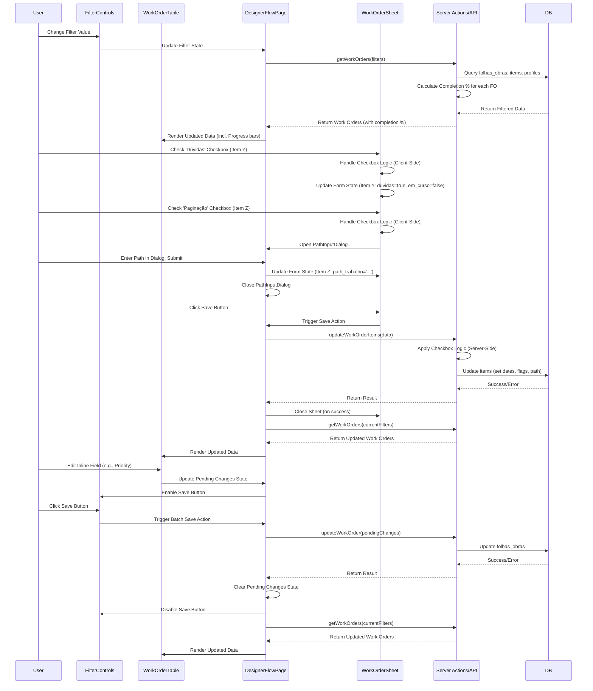

# Designer Flow App - Implementation Plan (Revised)

**1. Goal:** Implement a new application module within the IMACX Business Suite for managing designer workflows (`folhas_obras` and `items`), integrating seamlessly with the existing architecture and UI style.

**2. Technology Stack Alignment:**
*   **Framework:** Next.js 15+ (App Router)
*   **Language:** TypeScript 5
*   **UI:** React 19, **Shadcn/UI (Strictly)**, Tailwind CSS 4 (Adhering to project styles)
*   **State:** React Context (if needed), `useState`, `react-hook-form`
*   **Data:** Prisma 6+, Supabase Client, Next.js Server Actions or API Routes
*   **Validation:** Zod

**3. Setup & Configuration:**

*   **Directory Structure:** Create `app/(dashboard)/designer-flow/`
*   **Routing & Access Control:**
    *   Create `app/(dashboard)/designer-flow/page.tsx`.
    *   Update `middleware.ts`: Add `/designer-flow` to `protectedRoutes` with required roles `['admin', 'designer']`.
*   **Install Shadcn/UI Components:** Ensure all necessary components are available:
    ```bash
    npx shadcn-ui@latest add sheet progress table dropdown-menu input select checkbox switch button dialog alert-dialog form label textarea sonner
    ```
    *(Includes `Sheet`, `Progress`, `Table`, `Dialog`, `AlertDialog`, `Select`, `Checkbox`, `Switch`, `Input`, `Button`, `Form`, `Label`, `Textarea`, `Sonner`)*

**4. Backend / Data Layer (Server Actions or API Routes):**

*   **Location:** `app/(dashboard)/designer-flow/actions.ts` or `app/api/designer-flow/`.
*   **Core Functions:**
    *   `getWorkOrders(filters)`: Fetches `folhas_obras` joined with `items` and `profiles`, applying filters and sorting. **Crucially, calculates the completion percentage for each work order based on its items' `paginacao` status.**
    *   `getDesigners()`: Fetches profiles with `role_id = '3fd89b98-41bd-47e0-9f58-f59767c3090d'`.
    *   `createWorkOrder(data)`: Creates `folhas_obra` and associated `items`. **Sets default `em_curso=true` and `data_in` for new items.** Validates `numero_fo`.
    *   `updateWorkOrder(id, data)`: Updates `folhas_obra` fields.
    *   `updateWorkOrderItems(folha_obra_id, itemsData)`: Batch updates/creates/deletes `items`. **Implements the detailed status checkbox logic server-side to ensure data integrity (updating dates, `em_curso` flag, `path_trabalho`).**
    *   `deleteWorkOrder(id)`: Deletes `folhas_obra`.
    *   `deleteItem(id)`: Deletes a single `item`.
    *   `checkFoUniqueness(numero_fo)`: Utility for validation.

**5. Frontend Implementation:**

*   **Component Structure:**

    ```mermaid
    graph TD
        A[DesignerFlowPage (`page.tsx`)] --> B(FilterControls);
        A --> C(WorkOrderTable);
        A --> D(WorkOrderSheet);
        A --> E(DeleteConfirmationDialog);
        A --> F(PathInputDialog);

        C --> G(DataTable - Shadcn);
        C --> H(Progress - Shadcn); # Progress component included
        C --> I(DropdownMenu - Shadcn);
        C --> J(Checkbox - Shadcn);
        C --> K(Select - Shadcn);
        C --> L(Input - Shadcn);

        D --> M(Sheet - Shadcn);
        D --> N(WorkOrderForm);
        N --> O(Form - Shadcn);
        N --> P(Input - Shadcn);
        N --> Q(Textarea - Shadcn);
        N --> R(ItemsTable);
        R --> S(ItemRow);
        S --> T(Checkbox - Shadcn); # Checkboxes for status
        S --> U(Input - Shadcn);
        S --> V(Button - Shadcn);
        N --> W(Button - Shadcn);

        E --> X(AlertDialog - Shadcn);
        F --> Y(Dialog - Shadcn);
        F --> Z(Input - Shadcn);

        subgraph DesignerFlowPage [app/(dashboard)/designer-flow/page.tsx]
            direction LR
            A
        end

        subgraph Components [app/(dashboard)/designer-flow/components/]
            direction TB
            B --- BA(Switch - Shadcn)
            B --- BB(Select - Shadcn)
            B --- BC(Input - Shadcn)
            B --- BD(Button - Shadcn)

            C
            D
            E
            F
            N
            R
            S
        end
    ```

*   **`app/(dashboard)/designer-flow/page.tsx` (Main Page):**
    *   Fetch initial data (`getWorkOrders`, `getDesigners`).
    *   Manage overall state (filters, selected work order, sheet/dialog states).
    *   Render child components.

*   **`FilterControls` Component:**
    *   Render filter controls (`Switch`, `Select`, `Input`).
    *   Render "Save" button (enabled by pending changes).
    *   Render "New Work" button.

*   **`WorkOrderTable` Component:**
    *   Use Shadcn `DataTable`.
    *   **Columns:** Data In, FO, Designer (`Select`), Nome Campanha (`Input`), **Status (`Progress` component displaying calculated percentage)**, Data Saída, Prioridade (`Checkbox`), Ações (`Button`s).
    *   Track inline edits for the main "Save" button.
    *   Trigger sheet/dialogs.
    *   Implement sorting.

*   **`WorkOrderSheet` Component:**
    *   Use Shadcn `Sheet`.
    *   Use `react-hook-form` + `zod` for validation.
    *   Render form fields (`Input`, `Textarea`).
    *   Render `ItemsTable`.
    *   Render "Adicionar Item" button. **(New items should default `Em Curso` checkbox to checked in the form state).**
    *   Render "Salvar" button.

*   **`ItemsTable` (within Sheet):**
    *   Renders `ItemRow` for each item.
    *   `ItemRow`:
        *   Inputs for Descrição, Codigo.
        *   **Status Checkboxes (`Checkbox` components): Implement the precise client-side interaction logic:**
            *   **Em Curso:** Default checked for new items. Uncheck if `Dúvidas` is checked.
            *   **Dúvidas:** If checked, uncheck `Em Curso`.
            *   **Maquete Enviada:** Standard check/uncheck.
            *   **Paginação:** If checked, trigger `PathInputDialog`.
        *   Display fields for status dates, Path.
        *   Delete Item button.

*   **Status Checkbox Logic (Client-Side Handler):**
    *   Create a robust handler function or custom hook within the `WorkOrderSheet` or `ItemsTable` component.
    *   This handler will manage the state updates within the `react-hook-form` instance based on the specific rules:
        *   When `Dúvidas` is checked, programmatically set `Em Curso` to `false` in the form state.
        *   When `Paginação` is checked, open the `PathInputDialog`. Do *not* set dates client-side; rely on the backend to set dates upon successful save.
        *   Ensure default states are correctly initialized for new items (`Em Curso` checked).

*   **Dialogs:**
    *   `DeleteConfirmationDialog`: Use `AlertDialog`.
    *   `PathInputDialog`: Use `Dialog`. On submit, update the item's `path_trabalho` field in the `react-hook-form` state.

**6. State Management & Data Flow:**

*   **Filters:** State managed in the main `page.tsx`, passed down to `FilterControls` and used in data fetching calls.
*   **Work Order Data:** Fetched server-side (RSC) or client-side via Server Action/API call. Consider caching strategies if using client-side fetching (e.g., SWR, TanStack Query).
*   **Pending Changes:** Maintain a state variable (e.g., `isDirty`, or track changes in a separate object) in `page.tsx` to track inline edits in the table and changes within the sheet form. Enable the main "Save" button based on this state.
*   **Sheet Form State:** Managed by `react-hook-form` within the `WorkOrderSheet` component.
*   **Notifications:** Use `sonner` (or `react-toastify`) for feedback on save/delete operations.
*   **Status Calculation:** The `getWorkOrders` backend function calculates the percentage. The `WorkOrderTable` component receives this percentage and passes it to the Shadcn `Progress` component for display.



**7. Key Considerations & Business Logic:**

*   **Strict Shadcn/UI & Project Styles:** Adhere strictly to using components from Shadcn/UI and maintain consistency with existing project styling. Ask if any non-Shadcn component seems necessary.
*   **Checkbox Logic Implementation:** Implement the detailed logic for status checkboxes both client-side (for immediate UI feedback within the form) and server-side (for data validation and setting timestamps accurately upon saving).
*   **Status Calculation:** Ensure the backend correctly calculates the completion percentage (`(items with paginacao=true / total items) * 100`) and the frontend displays it using the `Progress` component.
*   Batch Saving, Validation, Error Handling, Loading States, Optimistic UI, Responsiveness (as before).

**8. Testing:**

*   Unit tests for utility functions, validation logic, and potentially component rendering.
*   Integration tests for data fetching and mutation logic (Server Actions/API).
*   End-to-end tests simulating user workflows (filtering, creating, editing, deleting).