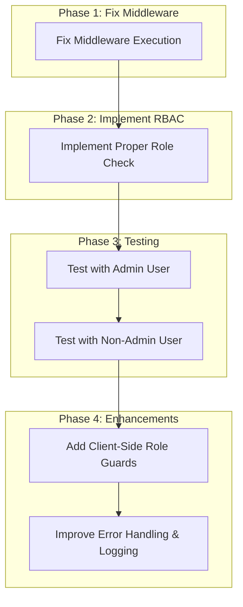

# Middleware Role-Based Access Control (RBAC) Implementation Plan

## Problem Analysis

1. **Middleware Execution Issue**: The middleware appears to not be executing or logging properly, which means the role checks aren't happening.

2. **Authentication Works**: The client-side authentication is working correctly - users can log in, and their profiles are being fetched.

3. **Route Inconsistency**: Some routes work while others redirect to the dashboard, suggesting an issue with how protected routes are handled.

4. **Database Structure**: The database relationships between users, profiles, and roles are correctly set up.

## Solution Plan



### Phase 1: Fix Middleware Execution

1. **Verify Middleware Registration**:
   - Ensure middleware.ts is in the correct location (root of the project)
   - Check that the matcher configuration is correct
   - Verify Next.js version compatibility with the middleware implementation

2. **Fix Console Logging**:
   - Modify the middleware to use server-side logging that will be visible in the terminal
   - Add more detailed logging at each step of the middleware execution

3. **Simplify Middleware Logic**:
   - Temporarily simplify the middleware to just log and pass through all requests
   - Once we confirm it's executing, gradually add back the authentication and role-checking logic

### Phase 2: Implement Proper Role Check

1. **Implement Two-Step Role Check**:
   - First, fetch the profile using the user ID from the session
   - Then, fetch the role name using the role_id from the profile
   - Add comprehensive error handling and logging at each step

2. **Optimize Database Queries**:
   - Use a single join query to get both profile and role information in one step
   - Ensure proper error handling if the query fails

3. **Implement Role Comparison Logic**:
   - Compare the user's role with the required roles for the requested route
   - Handle case sensitivity and other potential comparison issues

### Phase 3: Testing

1. **Test with Admin User**:
   - Verify that a user with the Admin role can access all routes
   - Confirm that middleware logs show the correct role being fetched and compared

2. **Test with Non-Admin User**:
   - Create a test user with a non-Admin role
   - Verify that they can only access routes allowed for their role
   - Confirm that unauthorized access attempts are properly redirected

### Phase 4: Enhancements

1. **Add Client-Side Role Guards**:
   - Enhance the sidebar to only show navigation items the user has access to
   - Use the existing `hasRole` and `hasAnyRole` functions in the auth context

2. **Improve Error Handling & Logging**:
   - Add more detailed error messages for different failure scenarios
   - Implement proper error pages for unauthorized access attempts

## Detailed Implementation Steps

### 1. Fix Middleware Execution

```typescript
// middleware.ts
import { NextResponse } from 'next/server'
import type { NextRequest } from 'next/server'
import { createMiddlewareClient } from '@supabase/auth-helpers-nextjs'

// Define protected routes and their required roles
const protectedRoutes = [
  // ... existing routes
]

export async function middleware(req: NextRequest) {
  // Add a simple log to verify middleware execution
  console.log(`[SERVER] MIDDLEWARE EXECUTING: ${req.nextUrl.pathname}`);
  
  // For API routes, just proceed without authentication checks
  if (req.nextUrl.pathname.startsWith('/api/')) {
    console.log(`[SERVER] MIDDLEWARE: API route - allowing access`);
    return NextResponse.next();
  }

  const res = NextResponse.next()
  const supabase = createMiddlewareClient({ req, res })

  try {
    // Check if user is authenticated
    const { data: { session } } = await supabase.auth.getSession()
    console.log(`[SERVER] MIDDLEWARE: Session exists: ${!!session}`);

    // Rest of the middleware logic...
    return res;
  } catch (error) {
    console.error(`[SERVER] MIDDLEWARE ERROR:`, error);
    return NextResponse.redirect(new URL('/login?error=middleware_exception', req.url));
  }
}

// Configure the middleware to run on specific paths
export const config = {
  matcher: [
    '/((?!_next/static|_next/image|favicon.ico|public).*)',
  ],
}
```

### 2. Implement Proper Role Check

```typescript
// middleware.ts (role check section)
// Inside the middleware function, after session check:

if (session) {
  const pathname = req.nextUrl.pathname;
  console.log(`[SERVER] MIDDLEWARE: Path = ${pathname} | User ID = ${session.user.id}`);

  const routeConfig = protectedRoutes.find(route => 
    pathname === route.path || pathname.startsWith(`${route.path}/`)
  );

  // If it's not a specifically protected route, allow access
  if (!routeConfig) {
    console.log(`[SERVER] MIDDLEWARE: Non-protected route - allowing access`);
    return res;
  }

  console.log(`[SERVER] MIDDLEWARE: Protected route - checking role`);
  
  try {
    // Single query with join to get profile and role in one step
    const { data, error } = await supabase
      .from('profiles')
      .select(`
        role_id,
        roles:role_id (
          name
        )
      `)
      .eq('user_id', session.user.id)
      .single();
    
    if (error || !data) {
      console.error(`[SERVER] MIDDLEWARE: Error fetching profile:`, error);
      return NextResponse.redirect(new URL('/login?error=profile_fetch_failed', req.url));
    }
    
    // Extract role name safely
    let userRole = '';
    if (data.roles && typeof data.roles === 'object') {
      userRole = data.roles.name?.toLowerCase() || '';
    }
    
    console.log(`[SERVER] MIDDLEWARE: User role = ${userRole}, Required roles = ${routeConfig.roles.join(', ')}`);
    
    // Check if user's role is allowed for this route
    const requiredRoles = routeConfig.roles.map(role => role.toLowerCase());
    if (requiredRoles.includes(userRole)) {
      console.log(`[SERVER] MIDDLEWARE: Role check PASSED`);
      return res;
    } else {
      console.log(`[SERVER] MIDDLEWARE: Role check FAILED - redirecting`);
      return NextResponse.redirect(new URL('/login?error=unauthorized', req.url));
    }
  } catch (error) {
    console.error(`[SERVER] MIDDLEWARE: Exception during role check:`, error);
    return NextResponse.redirect(new URL('/login?error=middleware_exception', req.url));
  }
}
```

### 3. Client-Side Role Guards

```typescript
// components/app-sidebar.tsx
"use client";

import Link from "next/link";
import { usePathname } from "next/navigation";
import { navigationItems } from "@/lib/config/navigation";
import { useAuth } from "@/lib/auth/auth-context";
import { cn } from "@/lib/utils";
import { Sidebar, /* other imports */ } from "@/components/ui/sidebar";

export function AppSidebar() {
  const pathname = usePathname();
  const { hasAnyRole } = useAuth();

  // Filter navigation items based on user's role
  const filteredNavItems = navigationItems.filter(item => {
    // Define role requirements for each navigation item
    const roleRequirements = {
      "/": ["admin", "manager", "staff", "user"],
      "/analytics": ["admin", "manager"],
      "/stock-management": ["admin", "manager", "staff"],
      "/quoting-system": ["admin", "manager", "staff"],
      "/production-management": ["admin", "manager"],
      "/employees": ["admin", "manager", "staff"],
      "/price-structure": ["admin", "manager", "staff", "user"],
      "/users": ["admin"],
      "/settings": ["admin", "manager", "staff", "user"],
      "/components": ["admin", "manager", "staff", "user"],
    };

    // Get required roles for this item
    const requiredRoles = roleRequirements[item.href as keyof typeof roleRequirements] || [];
    
    // Check if user has any of the required roles
    return hasAnyRole(requiredRoles);
  });

  return (
    <Sidebar collapsible="icon">
      <SidebarContent>
        <SidebarGroup>
          <SidebarGroupContent>
            <SidebarMenu>
              {filteredNavItems.map((item) => {
                const Icon = item.icon;
                const isActive = pathname === item.href;

                return (
                  <SidebarMenuItem key={item.title}>
                    <SidebarMenuButton asChild isActive={isActive}>
                      <Link href={item.href}>
                        <Icon className="h-4 w-4" />
                        <span className="group-data-[collapsible=icon]:hidden">{item.title}</span>
                      </Link>
                    </SidebarMenuButton>
                  </SidebarMenuItem>
                );
              })}
            </SidebarMenu>
          </SidebarGroupContent>
        </SidebarGroup>
      </SidebarContent>
    </Sidebar>
  );
}
```

## Expected Outcomes

1. **Middleware Execution**: The middleware will execute on all non-static routes and log its progress.

2. **Role-Based Access**: Users will only be able to access routes appropriate for their role.

3. **UI Consistency**: The sidebar will only show navigation items the user has access to.

4. **Error Handling**: Clear error messages will be shown if there are issues with authentication or authorization.

5. **Scalability**: The solution will work correctly as more users and roles are added to the system.